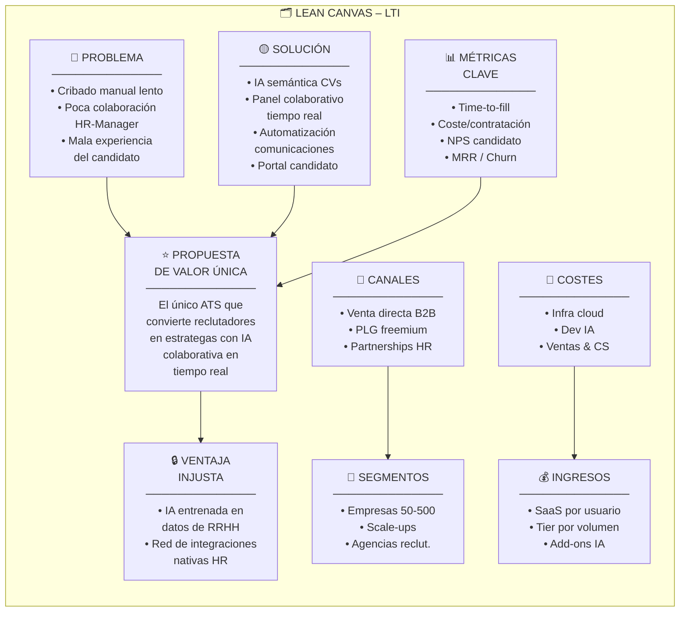
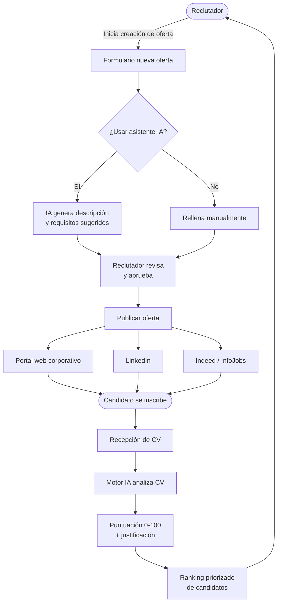
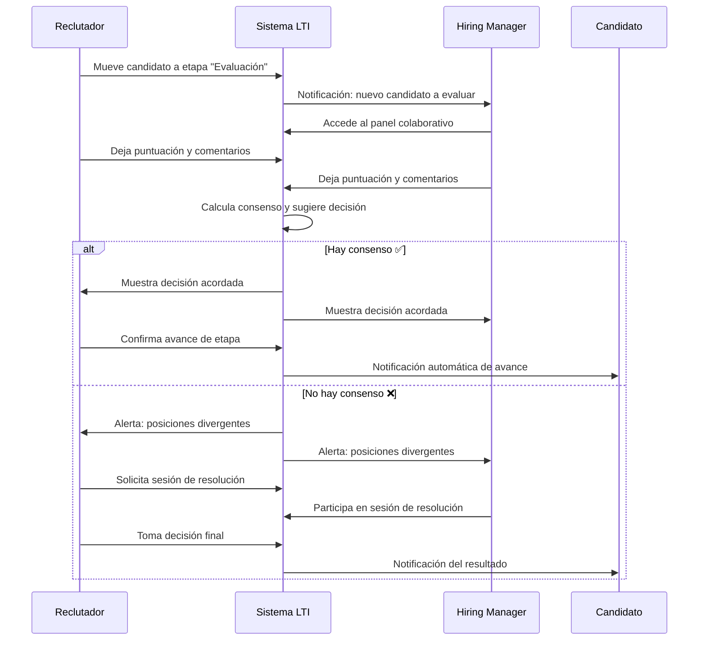
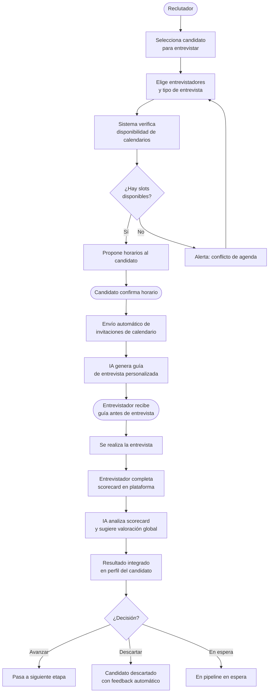
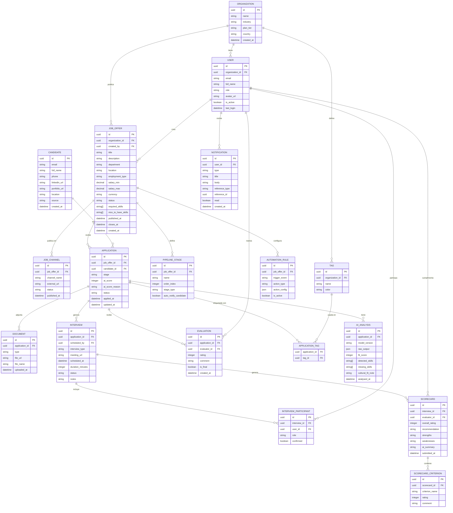
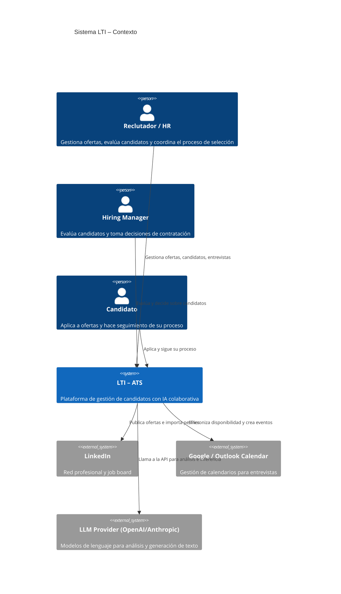
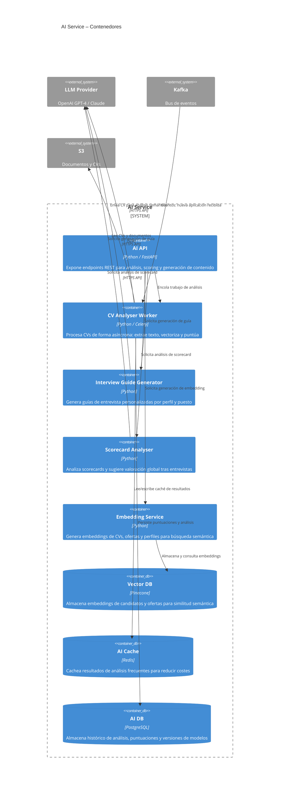
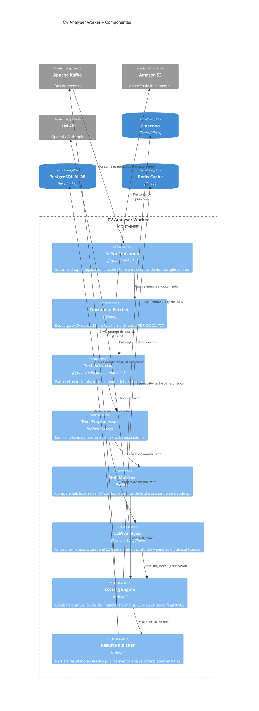

# LTI – Applicant Tracking System del Futuro

**Autor:** MBC
**Fecha:** 2026-03-28
**Versión:** 1.0

---

## Índice

1. [Descripción del producto](#1-descripción-del-producto)
2. [Lean Canvas](#2-lean-canvas)
3. [Casos de uso principales](#3-casos-de-uso-principales)
4. [Modelo de datos](#4-modelo-de-datos)
5. [Diseño de alto nivel](#5-diseño-de-alto-nivel)
6. [Diagrama C4](#6-diagrama-c4)

---

## 1. Descripción del producto

### ¿Qué es LTI?

**LTI (Lean Talent Intelligence)** es un ATS (Applicant Tracking System) de nueva generación diseñado para transformar la manera en que las empresas atraen, evalúan y contratan talento. A diferencia de los ATS tradicionales, que actúan como simples bases de datos de candidatos, LTI combina **inteligencia artificial**, **colaboración en tiempo real** y **automatización inteligente** para convertir el proceso de selección en una ventaja competitiva.

### Valor añadido y ventajas competitivas

| Dimensión | ATS tradicional | LTI |
|-----------|----------------|-----|
| Cribado de CVs | Manual o reglas básicas | IA semántica que evalúa competencias y fit cultural |
| Colaboración | Comentarios asíncronos por email | Panel compartido en tiempo real con roles y permisos |
| Automatización | Plantillas de email fijas | Flujos adaptativos según etapa, candidato e historial |
| Analítica | Informes estáticos | Dashboards predictivos con alertas de embudo |
| Integración | Escasa, propietaria | API abierta + conectores nativos (LinkedIn, Slack, Meet, Teams) |
| Experiencia candidato | Formularios genéricos | Portal personalizado, actualizaciones proactivas, chatbot 24/7 |

### Funciones principales

**1. Gestión inteligente de ofertas**
Creación de job descriptions asistida por IA con sugerencias de habilidades, salario de mercado y diversidad de lenguaje. Publicación multicanal con un solo clic (LinkedIn, Indeed, web corporativa, portales sectoriales).

**2. Motor de screening con IA**
Análisis semántico de CVs para puntuar automáticamente a cada candidato en función de los requisitos del puesto. Reducción del tiempo de cribado hasta en un 70%. Detección de candidatos recurrentes y recomendación de perfiles de la base de talento interna.

**3. Colaboración reclutador–manager en tiempo real**
Panel de kanban compartido donde reclutadores y hiring managers ven el estado de cada candidato, pueden dejar notas, votar y coordinar entrevistas sin salir de la plataforma.

**4. Automatización de flujos**
Envío automático de comunicaciones (confirmación, rechazo, feedback), programación de entrevistas con sincronización de calendarios y recordatorios. Triggers configurables por etapa del pipeline.

**5. Asistente de entrevistas con IA**
Generación de guías de entrevista personalizadas por perfil. Transcripción y análisis de entrevistas en vídeo. Scorecard automático con puntos clave detectados.

**6. Portal del candidato**
Interfaz de seguimiento para el candidato con estado en tiempo real, chatbot de resolución de dudas y posibilidad de agendar entrevistas directamente.

**7. Analítica predictiva y reporting**
Dashboards con métricas clave: tiempo de cobertura, coste por contratación, tasa de conversión por etapa, diversidad del pipeline, predicción de abandono del proceso.

**8. Cumplimiento y privacidad (GDPR)**
Gestión del consentimiento, anonimización automática, políticas de retención configurables y auditoría de accesos.

---

## 2. Lean Canvas

```
┌─────────────────────────────────────────────────────────────────────────────────────────┐
│                                   LEAN CANVAS – LTI                                     │
├───────────────────┬───────────────────────────┬───────────────────────────────────────┤
│   PROBLEMA        │   SOLUCIÓN                │   PROPUESTA DE VALOR ÚNICA            │
│                   │                           │                                        │
│ 1. Cribado manual │ · IA semántica de CVs      │ "El único ATS que convierte           │
│ lento y sesgado   │ · Scoring automático      │  reclutadores en estrategas            │
│                   │                           │  gracias a IA colaborativa             │
│ 2. Escasa         │ · Panel colaborativo      │  en tiempo real"                       │
│ colaboración HR-  │   en tiempo real          │                                        │
│ Manager           │                           │                                        │
│                   │ · Automatización de       │                                        │
│ 3. Mala           │   comunicaciones          │                                        │
│ experiencia del   │                           │                                        │
│ candidato         │ · Portal candidato 24/7   │                                        │
│                   │   con chatbot             │                                        │
├───────────────────┴───────────────────────────┼───────────────────────────────────────┤
│   MÉTRICAS CLAVE                              │   VENTAJA INJUSTA                     │
│                                               │                                        │
│ · Time-to-fill                                │ · Modelo de IA entrenado               │
│ · Coste por contratación                      │   específicamente en datos             │
│ · Tasa de conversión por etapa                │   de selección de talento              │
│ · NPS candidato                               │                                        │
│ · Retention rate (año 1)                      │ · Red de integraciones                 │
│ · MRR / Churn rate                            │   nativas con el ecosistema HR         │
├───────────────────────────────────────────────┴───────────────────────────────────────┤
│   CANALES                                                                              │
│                                                                                        │
│ · Venta directa B2B (mid-market y enterprise)  · Partnerships con consultoras HR      │
│ · PLG (Product-Led Growth) con freemium        · Marketplaces (HR Tech ecosystems)    │
├───────────────────────────────────────────────┬───────────────────────────────────────┤
│   SEGMENTOS DE CLIENTES                       │   ESTRUCTURA DE COSTES                │
│                                               │                                        │
│ Early adopters:                               │ · Infraestructura cloud (AWS/GCP)      │
│ · Empresas 50-500 empleados                   │ · Desarrollo y mantenimiento IA        │
│ · Equipos HR con alta rotación                │ · Equipo de ventas y CS                │
│ · Scale-ups en crecimiento                    │ · Costes de integración                │
│                                               │                                        │
│ Secundarios:                                  │   FUENTES DE INGRESOS                 │
│ · Grandes corporaciones                       │                                        │
│ · Agencias de reclutamiento                   │ · SaaS mensual por usuario             │
│                                               │ · Tier por volumen de ofertas          │
│                                               │ · Módulos IA premium add-on            │
└───────────────────────────────────────────────┴───────────────────────────────────────┘
```



---

## 3. Casos de uso principales

### Caso de uso 1: Publicación de oferta y cribado automático con IA

**Descripción:** El reclutador crea una nueva oferta de empleo con asistencia de IA, la publica en múltiples canales y el sistema realiza el cribado automático de los candidatos que se inscriben, generando un ranking priorizado.

**Actores:** Reclutador, Sistema IA, Job Boards (externos), Candidato

**Flujo principal:**
1. El reclutador inicia la creación de una oferta.
2. La IA sugiere título, descripción, habilidades requeridas y banda salarial.
3. El reclutador revisa, ajusta y aprueba la oferta.
4. El sistema publica la oferta en los canales seleccionados.
5. Los candidatos se inscriben desde distintos canales.
6. La IA analiza semánticamente cada CV y puntúa al candidato (0-100).
7. El reclutador accede al ranking priorizado con justificación de cada puntuación.



---

### Caso de uso 2: Evaluación colaborativa y toma de decisión entre reclutador y manager

**Descripción:** Una vez preseleccionados los candidatos, el reclutador y el hiring manager colaboran en tiempo real en el panel compartido: revisan perfiles, dejan evaluaciones, coordinan entrevistas y alcanzan consenso para avanzar o descartar candidatos.

**Actores:** Reclutador, Hiring Manager, Sistema de Notificaciones, Candidato

**Flujo principal:**
1. El reclutador mueve candidatos al pipeline de evaluación.
2. El sistema notifica al hiring manager.
3. Ambos acceden al panel compartido y ven el perfil del candidato.
4. Cada uno deja su puntuación y comentarios.
5. El sistema muestra el consenso y sugiere una decisión.
6. Si hay acuerdo, el candidato avanza de etapa.
7. Si no hay acuerdo, el sistema habilita una sesión de resolución.
8. El candidato recibe notificación automática del resultado.



---

### Caso de uso 3: Programación de entrevista y generación de scorecard asistida por IA

**Descripción:** El sistema automatiza la coordinación de entrevistas, sincronizando calendarios de los entrevistadores y el candidato, y genera una guía de entrevista personalizada. Tras la entrevista, el entrevistador completa el scorecard y la IA proporciona un análisis.

**Actores:** Reclutador, Entrevistador, Candidato, Sistema IA, Calendario (externo)

**Flujo principal:**
1. El reclutador programa una entrevista para un candidato.
2. El sistema verifica la disponibilidad de entrevistadores y candidato.
3. Se envían invitaciones y confirmaciones automáticas.
4. La IA genera una guía de entrevista personalizada según el perfil.
5. Se realiza la entrevista (presencial o videollamada).
6. El entrevistador completa el scorecard en la plataforma.
7. La IA analiza las notas y sugiere valoración global.
8. El resultado se integra en el perfil del candidato y en el pipeline.



---

## 4. Modelo de datos

### Descripción de entidades principales

El modelo de datos de LTI está centrado en las entidades que representan el ciclo de vida completo de un proceso de selección: desde la organización que contrata hasta el candidato que aplica, pasando por las ofertas, las aplicaciones, las entrevistas y las evaluaciones.



---

## 5. Diseño de alto nivel

### Descripción de la arquitectura

LTI adopta una **arquitectura de microservicios** donde cada servicio implementa internamente **arquitectura hexagonal (Ports & Adapters)**. El sistema se despliega mediante **contenedores Docker** orquestados con **Docker Compose**, lo que permite ejecutarlo en cualquier entorno: máquina local, servidor on-premise o cualquier proveedor cloud, sin dependencia de vendor.

**Estrategia de despliegue:**

| Entorno | Herramienta |
|---|---|
| Desarrollo local | Docker Compose (`docker compose up`) |
| Demo / staging | Docker Compose en servidor o VPS |
| Producción (futuro) | Kubernetes cuando el producto escale |

**Arquitectura hexagonal por microservicio:** Cada servicio se organiza en tres capas concéntricas:
- **Dominio:** Entidades, value objects y reglas de negocio puras. Sin dependencias externas.
- **Aplicación:** Casos de uso que orquestan el dominio y definen los puertos (interfaces).
- **Infraestructura:** Adaptadores que implementan los puertos: controladores REST, repositorios, consumidores Kafka, clientes de APIs externas.

**Capa de presentación:** Una Single Page Application (SPA) construida con React que consume la API Gateway. Una app móvil complementaria para reclutadores. Un portal web independiente para candidatos.

**API Gateway:** Punto de entrada único para todos los clientes. Gestiona autenticación (JWT/OAuth2), rate limiting, enrutamiento y observabilidad.

**Microservicios de dominio:** Cada servicio corre en su propio contenedor Docker, con su propia base de datos y desplegado independientemente:
- **Identity Service:** Gestión de usuarios, roles y permisos.
- **Jobs Service:** Ciclo de vida de ofertas, pipeline y etapas.
- **Candidates Service:** Perfil del candidato, documentos e historial.
- **Applications Service:** Estado de las aplicaciones y coordinación de flujo.
- **AI Service:** Motor de scoring, generación de guías, análisis de scorecards.
- **Interviews Service:** Programación, calendarios y gestión de entrevistas.
- **Notifications Service:** Email, in-app, Slack y webhooks.
- **Analytics Service:** Métricas, dashboards y reporting.
- **Integrations Service:** Conectores con LinkedIn, Indeed, Google/Outlook Calendar.

**Capa de mensajería:** Apache Kafka en contenedor como bus de eventos para comunicación asíncrona entre servicios. Los adaptadores de entrada de cada microservicio incluyen consumidores Kafka además de controladores REST.

**Capa de datos:** Cada servicio tiene su propia base de datos en contenedor. Los repositorios son adaptadores de salida que implementan los puertos definidos en el dominio: PostgreSQL (transaccional), Elasticsearch (búsqueda de candidatos), Redis (caché y sesiones), Pinecone (vectores IA), Object Storage (documentos), Data Warehouse (analytics).

**Capa de IA/ML:** Modelos LLM (OpenAI/Anthropic) para análisis semántico de CVs y generación de contenido. Pipeline de ML para scoring y predicciones. Vector database para búsqueda semántica de candidatos.

```mermaid
graph TB
    subgraph DOCKER["🐳 Docker Compose"]
        subgraph CLIENTS["👤 Clientes"]
            WEB["🖥️ Web App\nReact SPA"]
            MOB["📱 Mobile App\nReclutador"]
            CAND_PORTAL["🧑 Portal\nCandidato"]
            EXT["🔗 Integraciones\nexternas API"]
        end

        subgraph EDGE["🌐 Edge / Gateway"]
            CDN["☁️ CDN / Nginx\nProxy"]
            GW["🔀 API Gateway\nAuth · Rate Limit · Routing"]
            WS["⚡ WebSocket\nGateway (tiempo real)"]
        end

        subgraph SERVICES["⚙️ Microservicios · Arquitectura Hexagonal"]
            direction TB
            subgraph HEX["Estructura interna · cada servicio"]
                DOM["🔵 Dominio\nEntidades · Reglas negocio"]
                APP2["🟡 Aplicación\nCasos de uso · Puertos"]
                INF["🟢 Infraestructura\nAdaptadores REST · Repo · Kafka"]
                INF --> APP2 --> DOM
            end
            ID["🔐 Identity\nService"]
            JOBS["📋 Jobs\nService"]
            CANDS["👥 Candidates\nService"]
            APPS["📨 Applications\nService"]
            AI["🤖 AI\nService"]
            INT_SVC["🗓️ Interviews\nService"]
            NOTIF["🔔 Notifications\nService"]
            ANALYTICS["📊 Analytics\nService"]
            INTEGR["🔌 Integrations\nService"]
        end

        subgraph MESSAGING["📨 Mensajería"]
            KAFKA["Apache Kafka\nEvent Bus"]
        end

        subgraph DATA["🗄️ Capa de datos"]
            PG_JOBS["PostgreSQL\nJobs DB"]
            PG_CANDS["PostgreSQL\nCandidates DB"]
            PG_APPS["PostgreSQL\nApplications DB"]
            ES["Elasticsearch\nSearch & CVs"]
            REDIS["Redis\nCache & Sessions"]
            PINECONE["Pinecone\nVector DB"]
            DWH["Data Warehouse\n(PostgreSQL / ClickHouse)"]
            OBJ["Object Storage\nDocumentos"]
        end

        subgraph AI_LAYER["🧠 IA / ML"]
            LLM["LLM\nOpenAI / Anthropic"]
            ML_PIPELINE["ML Pipeline\nScoring & Predict."]
        end
    end

    subgraph EXTERNAL["🌍 Servicios externos"]
        LINKEDIN["LinkedIn API"]
        GCAL["Google Calendar"]
        OCAL["Outlook Calendar"]
        SLACK["Slack / Teams"]
        EMAIL["SMTP / SendGrid\nEmail"]
        INDEED["Indeed / InfoJobs"]
    end

    WEB --> CDN
    MOB --> GW
    CAND_PORTAL --> CDN
    EXT --> GW
    CDN --> GW
    GW --> ID
    GW --> JOBS
    GW --> CANDS
    GW --> APPS
    GW --> AI
    GW --> INT_SVC
    GW --> ANALYTICS
    WS --> APPS
    WS --> INT_SVC

    JOBS --> KAFKA
    APPS --> KAFKA
    CANDS --> KAFKA
    INT_SVC --> KAFKA
    KAFKA --> NOTIF
    KAFKA --> AI
    KAFKA --> ANALYTICS
    KAFKA --> INTEGR

    JOBS --- PG_JOBS
    CANDS --- PG_CANDS
    CANDS --- ES
    APPS --- PG_APPS
    ID --- REDIS
    AI --- PINECONE
    AI --- LLM
    AI --- ML_PIPELINE
    ANALYTICS --- DWH
    JOBS --- OBJ
    CANDS --- OBJ

    INTEGR --> LINKEDIN
    INTEGR --> GCAL
    INTEGR --> OCAL
    INTEGR --> SLACK
    NOTIF --> EMAIL
    NOTIF --> SLACK
    INTEGR --> INDEED
```



---

## 6. Diagrama C4

### Componente elegido: AI Service

El **AI Service** es el componente más diferenciador de LTI. Gestiona el análisis semántico de CVs, la generación de guías de entrevista, el scoring de candidatos y la asistencia inteligente a lo largo de todo el proceso de selección.

### Nivel 1 – Contexto del sistema



### Nivel 2 – Contenedores del AI Service



### Nivel 3 – Componentes del CV Analyser Worker



---

## Resumen ejecutivo

LTI se posiciona como el **ATS de nueva generación** que resuelve los tres grandes problemas del reclutamiento actual: ineficiencia en el cribado, desconexión entre HR y managers, y mala experiencia para el candidato. Su diferenciación radica en la integración nativa de IA en cada etapa del proceso, una arquitectura de microservicios que garantiza escalabilidad, y una capa de colaboración en tiempo real que acelera la toma de decisiones.

La arquitectura propuesta es cloud-native, event-driven y preparada para crecer desde startups hasta grandes corporaciones, con un modelo de negocio SaaS que permite una evolución incremental del producto.
